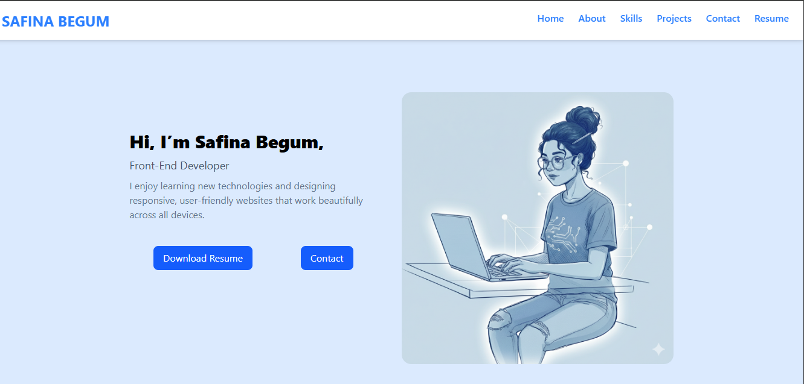
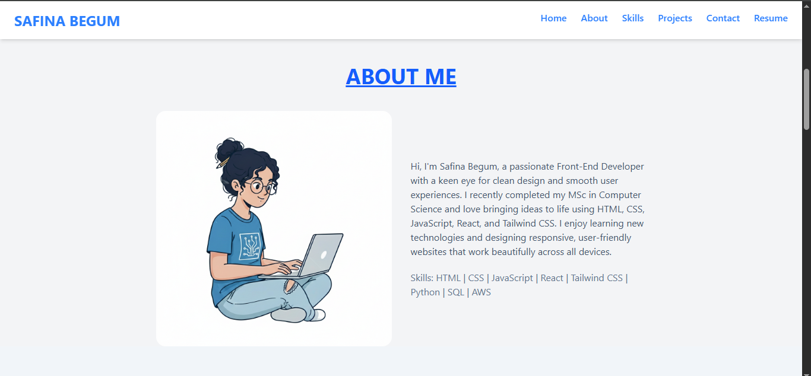

# PROTFOLIO - LIVE RESUME

* Know more about me and my work *

## 🚀 Features

- Responsive design
- Well structured folder

## 🛠️ Tech Stack

- React,React-router-DOM,Tailwind CSS ,react-scroll,react-icons

## ⚙️ Installation

 ** Clone the repository  **

   ```bash
  https://github.com/Dudekula-Safina-Begum/.git


  cd shopeasy
  npm install
  npm run dev   
  
  ```

## 📸 Screenshots
  



## 🌐 Live Demo
[Visit Shopeasy]( https://dudekula-safina-begum.github.io//)

## 📁 Folder Structure

``` bash

shopeasy/
 ├── src/
    ├── components
           ├ Navbar.jsx
           ├ Intro.jsx
           ├ Bar.jsx
           ├ Button.jsx
           ├ Card.jsx
           ├ ProjectCard.jsx
           └ Footer.jsx
           
    ├── context
           └ ProjectContext.jsx
    ├── pages
           ├ Home.jsx
           ├ About.jsx
           ├ Skills.jsx
           ├ Projects.jsx
           ├ Contact.jsx
           └ NotFound.jsx
    ├─── App.jsx

```

           
     
## 👩‍💻 Author
**Safina Begum**  
- 🌍 [GitHub](https://github.com/Dudekula-Safina-Begum)  
- 💼 Frontend Developer | Passionate about creative web design
 


